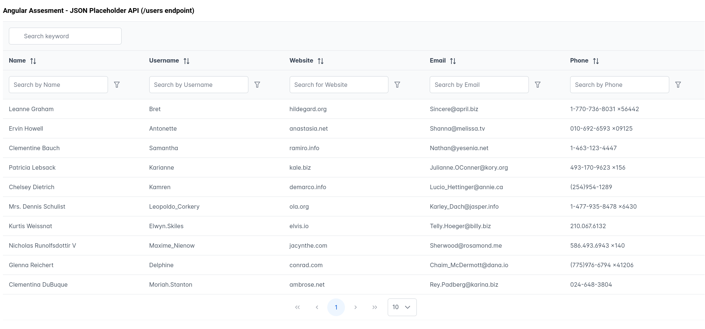

# Project Assesment (Project Preview)
Developer : Samuel Acquah

This project was generated with [Angular CLI](https://github.com/angular/angular-cli) version 18.1.3

 1. Create a basic Angular application that includes:

 • A sortable table displaying data from a public RESTful API (e.g., JSONPlaceholder).
 • The table should be responsive and allow users to sort data by any column.
 • Implement basic styling to ensure the table is visually appealing.
 2. Steps to Complete the Task:

 • Set up a new Angular project.
 • Create a component for the sortable table.
 • Fetch data from the public API and display it in the table.
 • Implement sorting functionality for the table columns.
 • Ensure the table is responsive across different devices.

## Development server

Run `ng serve` for a dev server. Navigate to `http://localhost:4200/`. The application will automatically reload if you change any of the source files.

## Code scaffolding

Run `ng generate component component-name` to generate a new component. You can also use `ng generate directive|pipe|service|class|guard|interface|enum|module`.

## Build

Run `ng build` to build the project. The build artifacts will be stored in the `dist/` directory.

## Running unit tests

Run `ng test` to execute the unit tests via [Karma](https://karma-runner.github.io).

## Running end-to-end tests

Run `ng e2e` to execute the end-to-end tests via a platform of your choice. To use this command, you need to first add a package that implements end-to-end testing capabilities.

## Further help

To get more help on the Angular CLI use `ng help` or go check out the [Angular CLI Overview and Command Reference](https://angular.io/cli) page.

## Sendr 
https://dribbble.com/shots/18976736-Send-an-Email